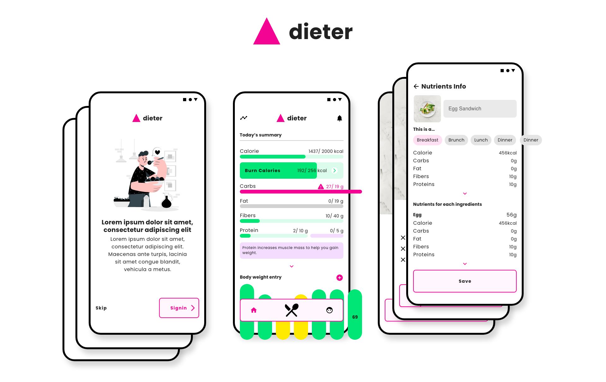
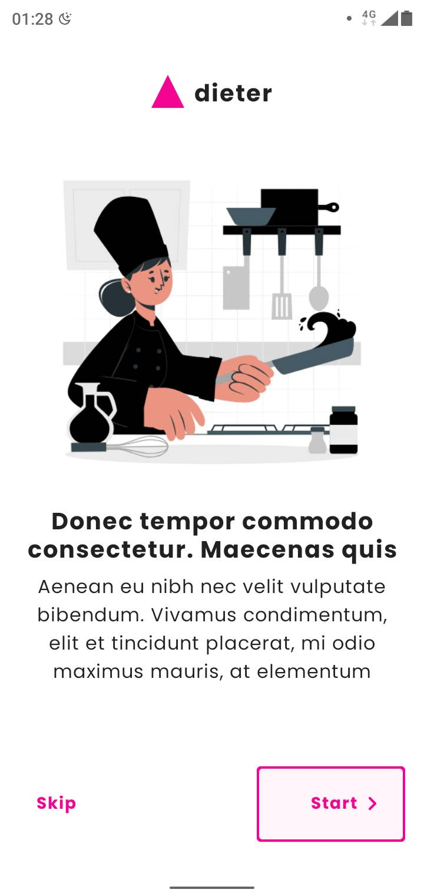
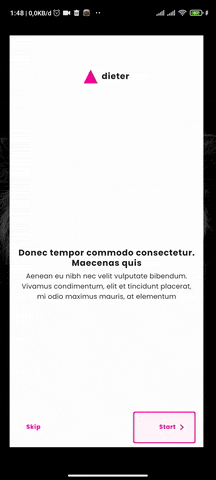

Dieter - Future cool app tagline
================================

[**To be replaced with proper description**] According to RISKESDAS, WHO and UNICEF the number of overweight Indonesian citizen has doubled over the past two decades. Obese people are more likely to suffer from non-communicable diseases, on the other hand Underweight is also a problem, 11.2% of Indonesian measured underweight that could lead to infertility. UNICEF Representative Debora Comini said "Good nutrition is not just about having enough food to eat but also getting the right food to eat, ", she also said that "many parents do not have sufficient knowledge to take the best decisions regarding their family’s food choices." With this app we aim to provide knowledge to the user  to make the right choice about what to eat. We'll recommend food and give nutritional value to help them make that decision.

# Getting Started
This project use Jetpack Compose, Android’s modern toolkit for building native UI. Jetpack Compose is currently in beta and only works with Canary Build of Android Studio.
- Clone this repository and open it in the latest [Android Studio (Canary build)](https://developer.android.com/studio/preview).
- Get the `google-services.json` file that I've sent in Discord
- Place the file in the `app` directory 
- You can't commit directly, therefore you have to fork this repository and submit a pull request.

# Screenshots

&emsp;

# Code formatting
The CI uses [Spotless](https://github.com/diffplug/spotless) to check if your code is formatted correctly and contains the right licenses.
Internally, Spotless uses [ktlint](https://github.com/pinterest/ktlint) to check the formatting of your code. Here's how to configure it for use with Android Studio (instructions adapted
from the ktlint [README](https://github.com/shyiko/ktlint/blob/master/README.md)):

- Close Android Studio if it's open

- Download ktlint using these [installation instructions](https://github.com/pinterest/ktlint/blob/master/README.md#installation)

- Apply ktlint settings to Android Studio using these [instructions](https://github.com/pinterest/ktlint/blob/master/README.md#-with-intellij-idea)

- Start Android Studio

Before committing your code, run `./gradlew app:spotlessApply` to automatically format your code.

# Third Party Content
- All illustrations used in this app are from stories.freepik.com
- [EDAMAM API](https://developer.edamam.com/) is used to get nutritional values
- [Poppins](https://fonts.google.com/specimen/Poppins?query=poppi#about) font, licensed under the [Open Font License](https://scripts.sil.org/cms/scripts/page.php?site_id=nrsi&id=OFL).

# License
Working on it!
